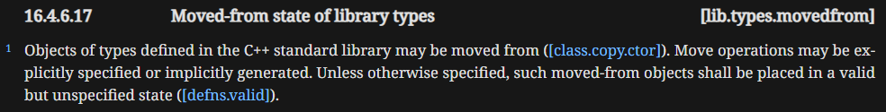
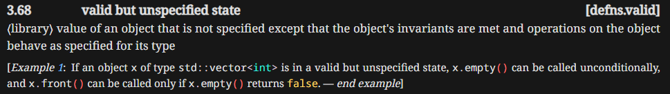
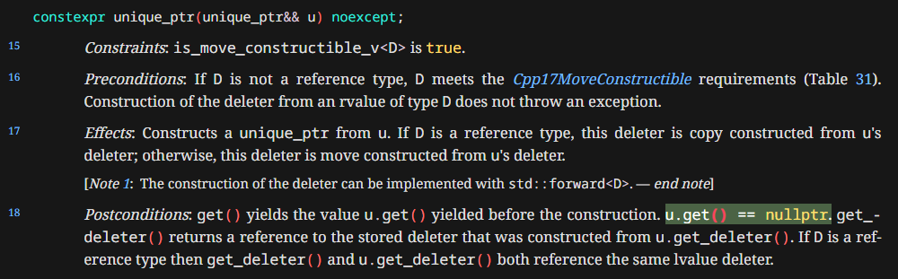
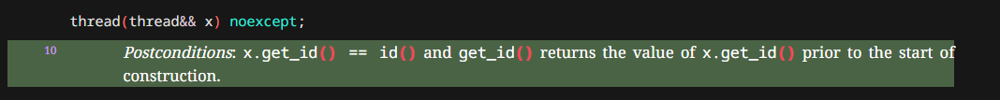
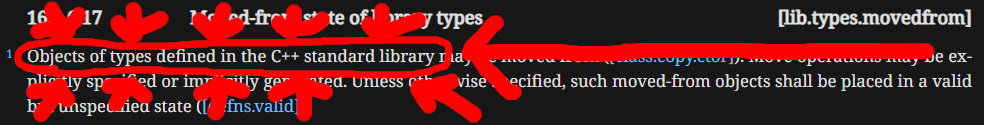

## Intro

There are a lot of misconceptions about state of *moved-from* objects.
Some people are scared of them, and believe they are invalid and it's better not to touch them.
Others think that such objects are left in "valid but unspecified state", but I argue that this interpretation is incomplete.

I love being proved wrong, so if you have compelling arguments against my case please let me know!

Okay, let's see what the standard says about *moved-from* objects:



> source: https://eel.is/c++draft/lib.types.movedfrom

Standard says: "unless otherwise specified, they are in valid but unspecified state".
But what exactly does it mean? How can an object be in a valid and unspecified state at the same time? 

In another place it's well explained:



> source: https://eel.is/c++draft/defns.valid

Which basically means that "valid but unspecified" is about preserving the invariants of an object.
In other words you can call any function on an object that does not have any preconditions.
Which makes sense - you can always call `.size()` on `std::vector`, but you should not try getting the 5th element: `vec[4]` if you don't know that vector has five elements. 

## Otherwise specified case

The first quote from standard had an important gotcha: "unless otherwise specified".
What are those cases when "something else" is specified?

### std::unique_ptr

There are a lot of cases when class author specifies the state of moved-from objects, but let's give a couple of examples from the C++ Standard Library.
One of the most notable ones is `std::unique_ptr`. The standard specifies behavior of its move constructor as follows:



> source: https://eel.is/c++draft/unique.ptr#single.ctor-15

This move constructor refers to its source object by `u`, and its postcondition specifies that calling `u.get()` will yield `nullptr`.
Therefore the state of *moved-from* object of type `std::unique_ptr` is **specified**.

### std::thread

Another such example is `std::thread`:



> source: https://eel.is/c++draft/thread.thread.constr#10

It says that *moved-from* object `x` of type `std:thread` has following property: `x.get_id() == id()`.
What does it actually mean? What is `id()`?

Standard explains it at another place:


> source: https://eel.is/c++draft/thread.thread.id#5

Which basically means that if you have an object of type `thread::id` which has its `id` equal to `id()`, then it's not connected to any underlying thread of execution.
Which together with previous paragraph means that *moved-from* `std::thread` is not associated with any underlying thread.
Therefore the state of *moved-from* object of type `std::thread` is **specified**.

To sum up: the general rule is that *moved-from* objects are in valid but unspecified state, unless their post-move state is explicitly specified like in case of `std:unique_ptr` or `std::thread`.

But I said in the beginning that *moved-from* objects are NOT in "valid but unspecified" state. So what's the deal?

## Rule for "moved-from" objects

Let's look at the my first citation from standard, along with some hints:



Do you see it now? The rule about "valid but unspecified state" only refers to types from the C++ standard library.

Does the standard say anything about types outside of standard library? It does not. Therefore I might now answer the question from the title: **the state of moved-from object is not specified by standard and it fully depends on the class author**.

Note that such objects are still alive in the sense that their lifetime has not ended.

## Practicalities

The standard is one thing, writing sensible C++ and following good practices is another.
And while it's true that your *moved-from* state can be whatever you want, there are some requirements if you need to use your type inside the C++ standard library. 

For example `std::vector` requires that your type is `Erasable`. This means that its destructor should run just fine, without any *undefined behavior*. If a move constructor leaves the object in a state where its destruction would result in *undefined behavior*, then the type does not satisfy `Erasable`.

There are also more restrictions for specific member functions of `std::vector`. While the language does not constrain the *moved-from* state of objects, using them in standard containers may impose additional requirement. For example `std::vector<T>::erase()` requires `T` to be *MoveAssignable*.

## Common misconceptions

I often see this phrase "valid but unspecified state"  being thrown around like it was an universal rule. I think this is some overgeneralization and it's not necessarily correct.

For example: **Raymond Chen** in his blog ["What should the state of a moved-from object be?"](https://devblogs.microsoft.com/oldnewthing/20201218-00/?p=104558) says:

> The language specifies that a moved-from object is in a legal but indeterminate state.

**Andres Fertig** in his CppCon 2022 talk [Back to Basics: C++ Move Semantics](https://youtu.be/knEaMpytRMA?t=1806) is claiming:

> such an object(moved-from) is in a valid, yet unkown state

**Jon Kalb** in his CppCon 2024 talk [Moved-from Objects in C++](https://youtu.be/FUsQPIoYoRM) is also says that calling destructor and assignment operator must be safe on move-from objects.
And while I agree that this is a sensible thing to require from your types, especially if you need to use them in STL containers, this is not a requirement of C++ language.

I have only respect and love for these guys (as for every other human being), but I don't think that their statements are true. Maybe I'm taking their words out of the context when they mean just types from the C++ standard library, but in my opinion it's important to distinguish the requirements that the language itself imposes from those of the C++ standard library.

## Destructive cost of non-destructive move

Last but not least. The performance cost of move in C++.

When defining move semantics, you face a choice: *destructive* move vs *non-destructive* move.
*Destructive* move means that the source objects is destroyed and you are not allowed to have fun with it anymore, while *non-destructive* move leaves the source in some state. 

Rust chooses the **destructive** move, while C++ went the other way. What is the performance cost of **non-destructive** move? It obviously depends on specific type, but lets talk about STL.

### std::vector

The implementation of `std::vector` is usually simple, it must store the pointer to data, size and capacity. The move constructor should zero the size and capacity, and set the pointer that points to data into `nullptr`. Let's look into its implementation in `libc++`

```c++
template <class _Tp, class _Allocator>
_LIBCPP_CONSTEXPR_SINCE_CXX20 inline _LIBCPP_HIDE_FROM_ABI vector<_Tp, _Allocator>::vector(vector&& __x)
#if _LIBCPP_STD_VER >= 17
    noexcept
#else
    _NOEXCEPT_(is_nothrow_move_constructible<allocator_type>::value)
#endif
    : __alloc_(std::move(__x.__alloc_)) {
  this->__begin_ = __x.__begin_;
  this->__end_   = __x.__end_;
  this->__cap_   = __x.__cap_;
  __x.__begin_ = __x.__end_ = __x.__cap_ = nullptr;
}
```

> source: https://github.com/llvm/llvm-project/blob/eff4d473c3fc4efd21136f818933b443de7817a6/libcxx/include/__vector/vector.h#L951

There are three pointers being reset to `nullptr`. You may say: "ok, it's not a big performance hit, I can live with that".

Okey dokey, fasten your seatbelts because we are going on a trip to another container.

### std::list

If we look into the move constructor of `std::list` things look following:

```c++
template <class _Tp, class _Alloc>
_LIBCPP_CONSTEXPR_SINCE_CXX26 inline list<_Tp, _Alloc>::list(list&& __c) noexcept(
    is_nothrow_move_constructible<__node_allocator>::value)
    : __base(std::move(__c.__node_alloc_)) {
  splice(end(), __c);
}
```

> source: https://github.com/llvm/llvm-project/blob/eff4d473c3fc4efd21136f818933b443de7817a6/libcxx/include/list#L1128

Function `splice()` is defined as such:

```c++  {linenos=true}
template <class _Tp, class _Alloc>
_LIBCPP_CONSTEXPR_SINCE_CXX26 void list<_Tp, _Alloc>::splice(const_iterator __p, list& __c) {
  _LIBCPP_ASSERT_VALID_INPUT_RANGE(
      this != std::addressof(__c), "list::splice(iterator, list) called with this == &list");
  if (!__c.empty()) {
    __base_pointer __f = __c.__end_.__next_;
    __base_pointer __l = __c.__end_.__prev_;
    __base::__unlink_nodes(__f, __l);
    __link_nodes(__p.__ptr_, __f, __l);
    this->__size_ += __c.__size_;
    __c.__size_ = 0;
  }
}
```

> source: https://github.com/llvm/llvm-project/blob/94482e8a6791930fe438537e0376247bbfac16cf/libcxx/include/list#L1498

As you can see the move constructor of `std::list` is not that trivial, it requires a couple of helper functions and preserving invariant of `std::list` requires leaving a *sentinel* node behind in a valid state, which is finally done by `__unlink_nodes` in line 8:

```c++
template <class _Tp, class _Alloc>
_LIBCPP_CONSTEXPR_SINCE_CXX26 inline void
__list_imp<_Tp, _Alloc>::__unlink_nodes(__base_pointer __f, __base_pointer __l) _NOEXCEPT {
  __f->__prev_->__next_ = __l->__next_;
  __l->__next_->__prev_ = __f->__prev_;
}
```

> source: https://github.com/llvm/llvm-project/blob/94482e8a6791930fe438537e0376247bbfac16cf/libcxx/include/list#L601

My point is that for some types the move constructor may require non-trivial logic, and preserving object invariants always comes at a cost.

"Ok, so why the C++ does not implement the destructive move?" - you might ask. The answer is simple: inheritance. If you have a hierarchy of classes you can neither move the base class before the derived class, nor the derived class before the base class because you will always end up with one object having derived part already constructed, but not yet constructed base part. This problem was also discussed in [A Proposal to Add Move Semantics Support to the C++ Language](https://www.open-std.org/jtc1/sc22/wg21/docs/papers/2002/n1377.htm).

So how does Rust manage to have a destructive move? You guessed it right, by not having inheritance. A truly outstanding move.

## Conclusions

The C++ standard does not define semantic state for moved-from objects for user-defined types. It only says that object has still valid lifetime.
The “valid but unspecified state” is a library-level guarantee and does not apply as a general language rule to all user-defined types.
